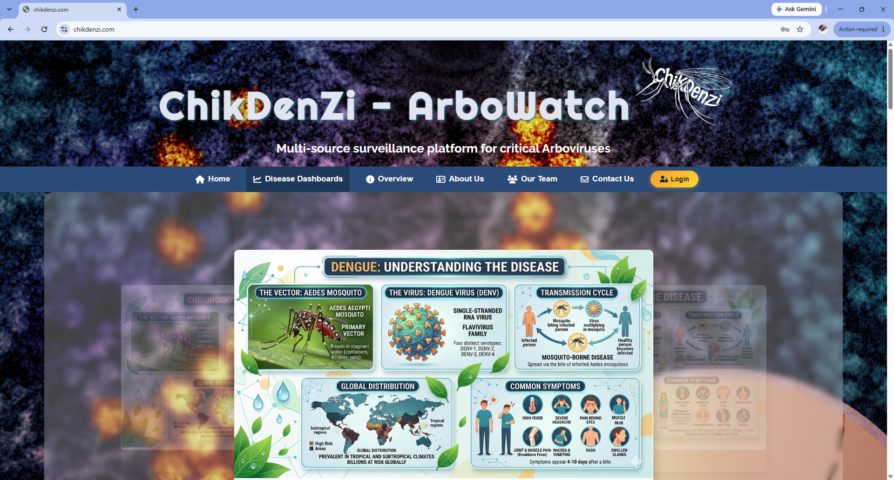
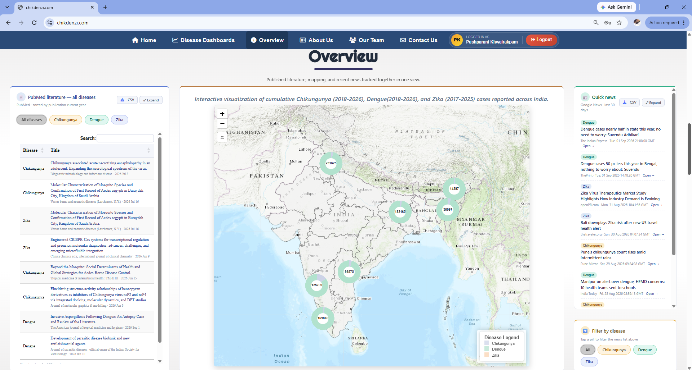
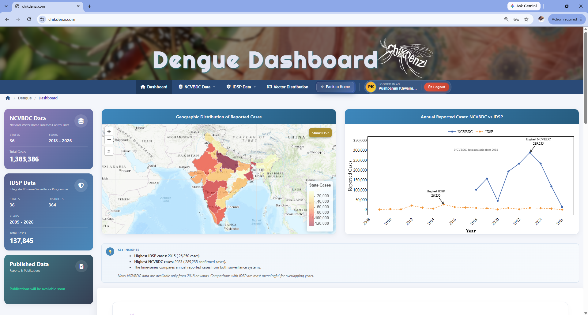
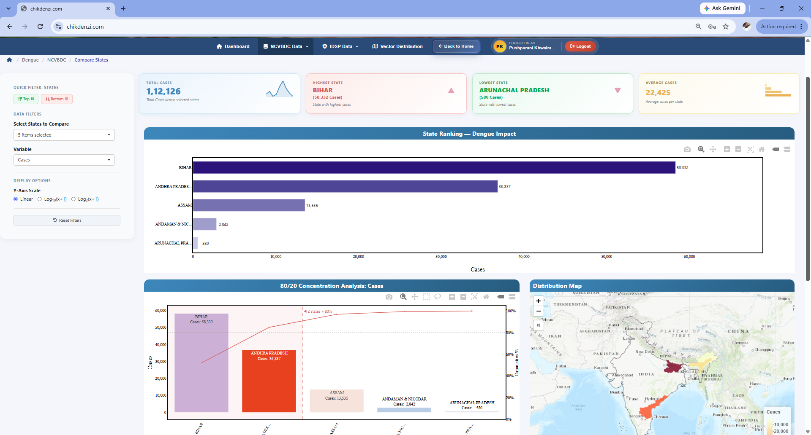
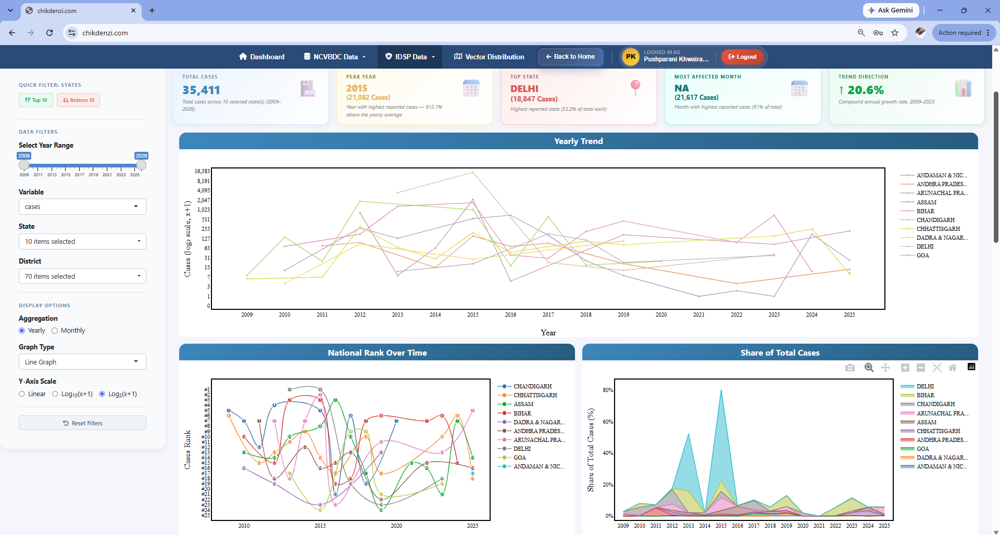
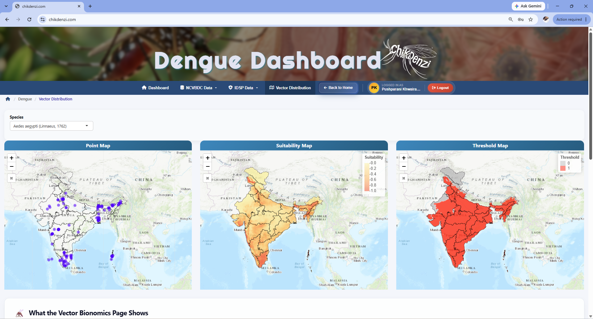

# ChikDenZi – ArboWatch

Interactive R Shiny web application for surveillance and analysis of **Chikungunya, Dengue and Zika** in India, featuring dynamic visualizations and geospatial mapping with Leaflet.

🔗 **Live app:** https://chikdenzi.com

## About

ChikDenZi – ArboWatch is a multi-source surveillance platform that brings disease data, scientific literature and real-time news together in one place. Each of the three diseases has its own dashboard for researchers, students and policymakers.

## Features

- **Home and Overview page:** a live PubMed literature feed for the current year, an interactive map of cumulative cases by state, and a real-time news feed
- **Disease dashboards:** dedicated dashboards for Chikungunya, Dengue and Zika
- **Two surveillance data sources:** NCVBDC and IDSP data, with summary cards and a side-by-side comparison of annual reported cases
- **Overview analysis:** filters for year range, suspected vs confirmed cases, cases vs deaths and bar or line graphs, plus year-wise intensity heatmaps, top reporting states and searchable state-wise data tables
- **National trends:** state-wise trend lines, peak year, most affected month, trend direction and each state's share of total cases over time
- **Compare states and districts:** state rankings, Pareto (80/20) concentration analysis and district-level comparison within a state
- **Seasonal patterns:** monthly heatmaps that show when cases surge
- **Vector distribution:** maps for *Aedes aegypti* and *Aedes albopictus* showing adult collection sites, environmental suitability and presence-absence thresholds
- **Disease information pages:** clinical symptoms, transmission and etiology in accessible language
- **Login-based access** to the full analytical dashboards

## Screenshots
| Home | 
|  |
|---|
| Overview | Disease dashboard |
|---|---|
|  |  |

| NCVBDC analysis | IDSP analysis |
|---|---|
|  |  |

| Vector distribution |
|---|
|  |

## Tech stack

R · Shiny · Leaflet · AWS Lightsail

## Data sources

All data comes from publicly available sources: the National Centre for Vector Borne Diseases Control (NCVBDC), the Integrated Disease Surveillance Programme (IDSP), and peer-reviewed scientific literature.

## Credits

**Developed by:** Pushparani Khwairakpam (dashboard development and data analysis)

**Project lead:** Dr. Amit Sharma
Structural Parasitology and Virus Research groups, International Centre for Genetic Engineering and Biotechnology (ICGEB), New Delhi

## Note

The source code is kept in a private repository. For collaboration or feedback, please use the contact form at https://chikdenzi.com.
